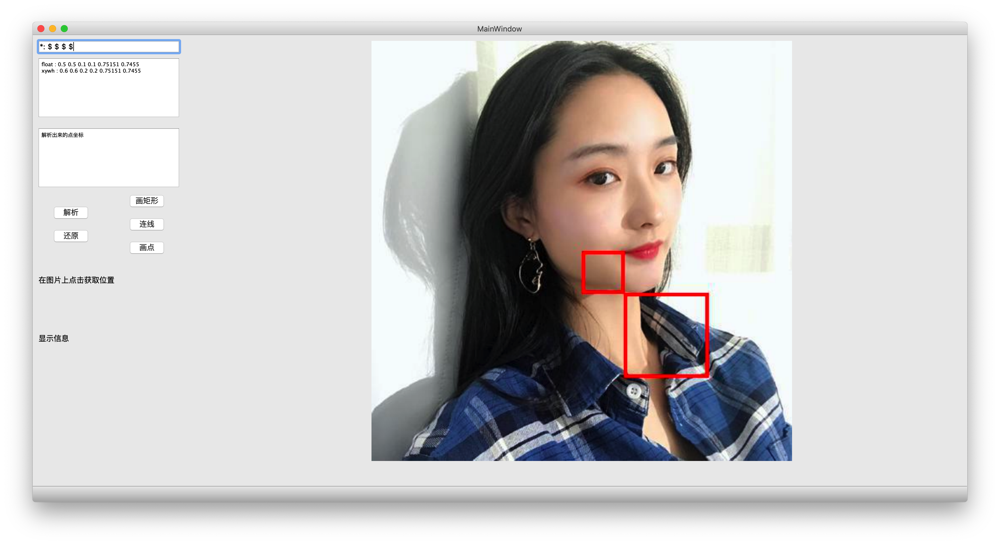
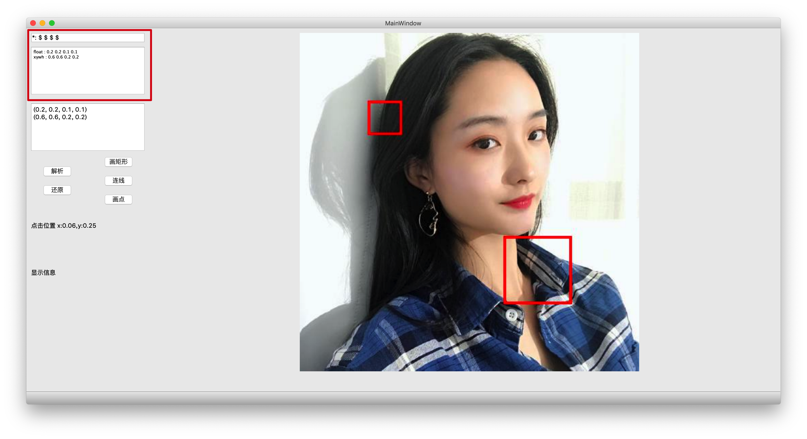

# DrawLine
pyqt写的画线小工具,可以显示画的目标框以及显示yuv

## 环境

* python3
* pyqt5
* python接口的opencv
* 其他python常用库

## 展示

## 功能

### 画矩形 直线

其中左上角这部分相当于正则

以一个`$`表示float类型,来匹配字符串,可以直接拖拽图片进入目录

中间较大的框会按照输入规则解析日志,请将日志按照矩形宽高`xywh`的格式输入

点按照`xy`形式输入

实际测试,window上点击`画矩形`可以立刻显示,但是mac上点到别的区域,再点回来,类似强制刷新一下,这似乎是pytqt系统实现之间的区别

点击`还原`可以恢复原始的图片

### 显示YUV

显示yuv需要json后缀,这部分有配套的C代码,具体结构体为一个HEAD+FrameDataInfo.

可以参见cpp/info.h文件

Yuv显示适合做视频检测的测试.可以显示目标ID,属性,得分,检测框等信息

